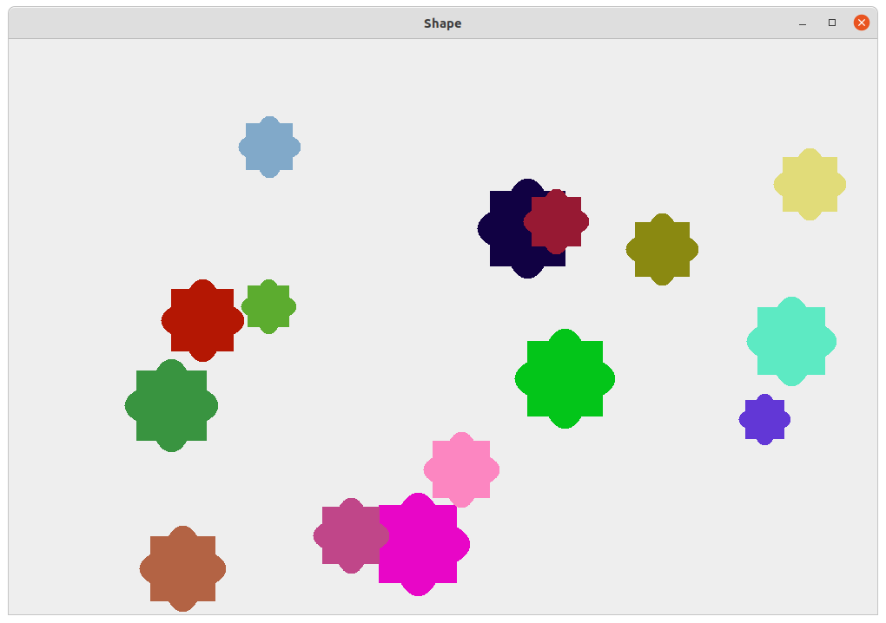

# ScreenSaver

> The program generates shapes with different colours, sizes and speed.
> The shapes deflects when they touch the border.



## Running Program

OS X & Linux terminal:

```sh
javac *.java
java ShapeViewer
```

Windows cmd:

```sh
javac Shape1.java Shape2.java Shape3.java Shape3Animated.java ShapeComponent.java ShapeViewer.java
java ShapeViewer
```
